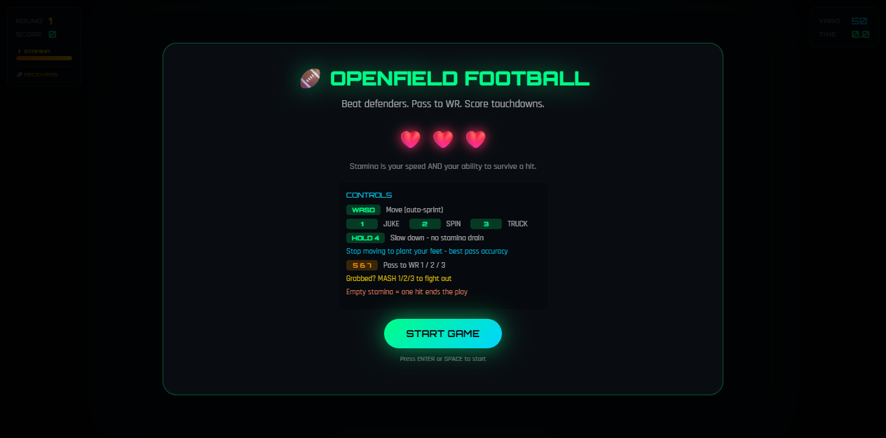
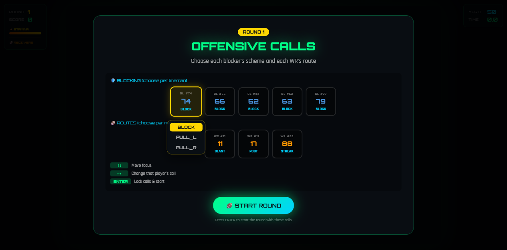
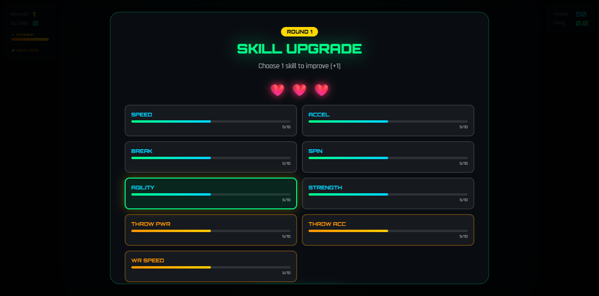
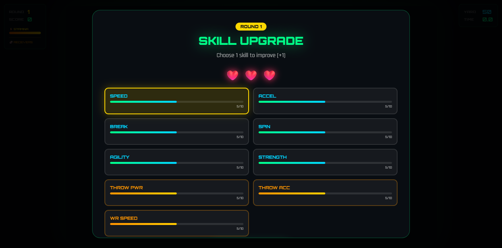

# Openfield Football

A browser-based **arcade American football game** — dodge defenders, call plays at the line of scrimmage, pass to your wide receivers, and score touchdowns. Built as a single self-contained HTML file with no build step.

## Screenshots / Visual Walkthrough





## Features
- Neon cyberpunk launch menu with lives + stamina HUD
- Pre-snap offensive calls: set each OL’s block scheme (BLOCK / PULL_L / PULL_R) and each WR’s route before the snap
- Auto-sprint movement (WASD); hold `4` to slow without stamina drain
- Skill moves: `1` Juke · `2` Spin · `3` Truck
- Pass to WR 1 / 2 / 3 with `5` / `6` / `7`; hold `4` to plant feet for set-factor accuracy
- Bullet / lob pass mechanic: tap `4` for a fast bullet, hold `4` for a high-arcing lob
- 3-WR roster with route running + openness HUD
- Dynamic defensive scout screen before each round
- 8 defender archetypes (incl. the new **LOB** tight-zone closer) with stamina-gated special abilities
- Wrap-up struggle system: fight / break free / get tackled
- **HANDS** skill upgrade: more reliable catches, fewer drops
- Sticky corner coverage — defenders now stay on their receiver through scrambles
- Camera zoomed in for better field readability

## Tech stack
- Single HTML file game loop (`open_field_v6.html`)
- Canvas rendering
- Regression checks via `harness.js` + `test.js` + `scripts/verify-v7.cjs`

## Quickstart
```bash
git clone https://github.com/Romere997/OpenfieldFootball.git
cd OpenfieldFootball
npm test
open open_field_v6.html
```

## Project structure
```
├── open_field_v6.html        # Latest playable build
├── harness.js                 # Headless harness for automated checks
├── test.js                    # Legacy harness tests
├── scripts/verify-v7.cjs      # V7 feature verification
├── package.json               # Script runner wrapper
├── CHANGELOG.md               # Release notes
├── docs/                      # Design docs + screenshots
│   └── images/
└── screenshots/               # Raw captures from current build
```

## Testing and Evidence
```bash
npm run test
```
Last verified run: **8/8** legacy tests + **5/5** V7 verification + **2/2** AC-10 acceptance checks, all passing.

## Project status
Tested / Portfolio Ready

### Known limitations
- `test.js` reflects V6-era contracts and does not assert every V7 flow
- WR input is present in the harness/port but coverage is limited to smoke checks
- No mobile build or PWA install flow

### Roadmap
- Expand harness coverage for struggle states and interception paths
- Add automated screenshot diff regression for render stability
- Optional mobile wrapper / key rebind UI

## Design Decisions
- **Pre-snap calls instead of per-player pop-up wheels:** kept UI consistent with existing scout/upgrade flow rather than adding a new interaction paradigm mid-play.
- **PULL linemen side-locked assignment:** a pulled blocker is off the line — his job is the blitzer, not the D-line — so he only picks up threats on his declared side.
- **Committed blocker assignments:** blockers hold their man until the block dies. This prevents the churn where OLs re-targeted every 0.35s and never actually engaged a blitzer.
- **Camera zoom at 8.5:** chosen to tighten the baseline angle without hiding WR routes.

## Human and AI contributions
- Ross Presendieu: design direction, gameplay target, accepted V7 surface and feature list, repo owner
- Nano / Hermes Agent: full V7 port into existing repo, pre-snap calls implementation, blitz pickup + coverage fixes, harness updates, acceptance reports, plugin generation, screenshot captures

## Security and Privacy
- No credentials, API keys, or personal data are committed.
- The game is fully client-side; there is no server-side data collection.

## License
MIT — see LICENSE.
