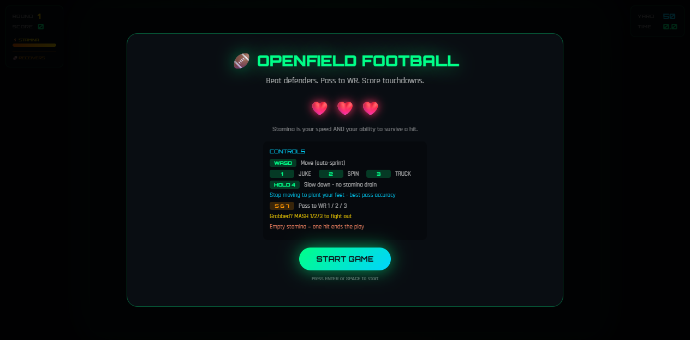

# 1v1 Football (Open Field) — Open Field V7

A browser-based **arcade American football game** — dodge defenders, pass to your
wide receiver, and score touchdowns. Built as a single self-contained HTML file
with a Node/Vm harness for regression checks.



## Features
- Neon cyberpunk launch menu with lives + stamina HUD
- Auto-sprint movement (WASD); hold `4` to slow without stamina drain
- Skill moves: `1` Juke · `2` Spin · `3` Truck
- Pass to WR 1 / 2 / 3 with `5` / `6` / `7`
- 3-WR roster with route running + openness HUD
- Dynamic defensive scout screen before each round
- 7 defender archetypes with stamina-gated special abilities
- Wrap-up struggle system: fight / break free / get tackled
- Set-factor QB pass accuracy

## Tech stack
- Single HTML file game loop
- Canvas rendering
- Harnessed validation via `harness.js` + `test.js`

## Quickstart
```bash
git clone https://github.com/Romere997/1v1-Football-Start.git
cd 1v1-Football-Start
npm test
open open_field_v6.html
```

## Project structure
```
├── open_field_v6.html     # Latest playable build = Open Field V7
├── harness.js              # Headless harness for automated checks
├── test.js                 # Legacy harness tests
├── scripts/verify-v7.mjs   # V7 feature verification
├── package.json            # Script runner wrapper
└── CHANGELOG.md            # Release notes
```

## Screenshots
- Start screen: `screenshots/menu.png`

## Project status
Functional / Tested

### Known limitations
- `test.js` reflects V6-era contracts and does not assert every V7 flow
- WR input is present in the harness/port but coverage is limited to smoke checks
- No mobile build or PWA install flow

### Roadmap
- Expand harness coverage for struggle states and interception paths
- Add automated screenshot diff regression for render stability
- Optional mobile wrapper / key rebind UI

## Human and AI contributions
- Ross Presendieu: design direction, gameplay target, accepted V7 surface and feature list
- Nano / Hermes Agent: full V7 port into existing repo, harness updates, acceptance reports

## License
MIT — see LICENSE.
